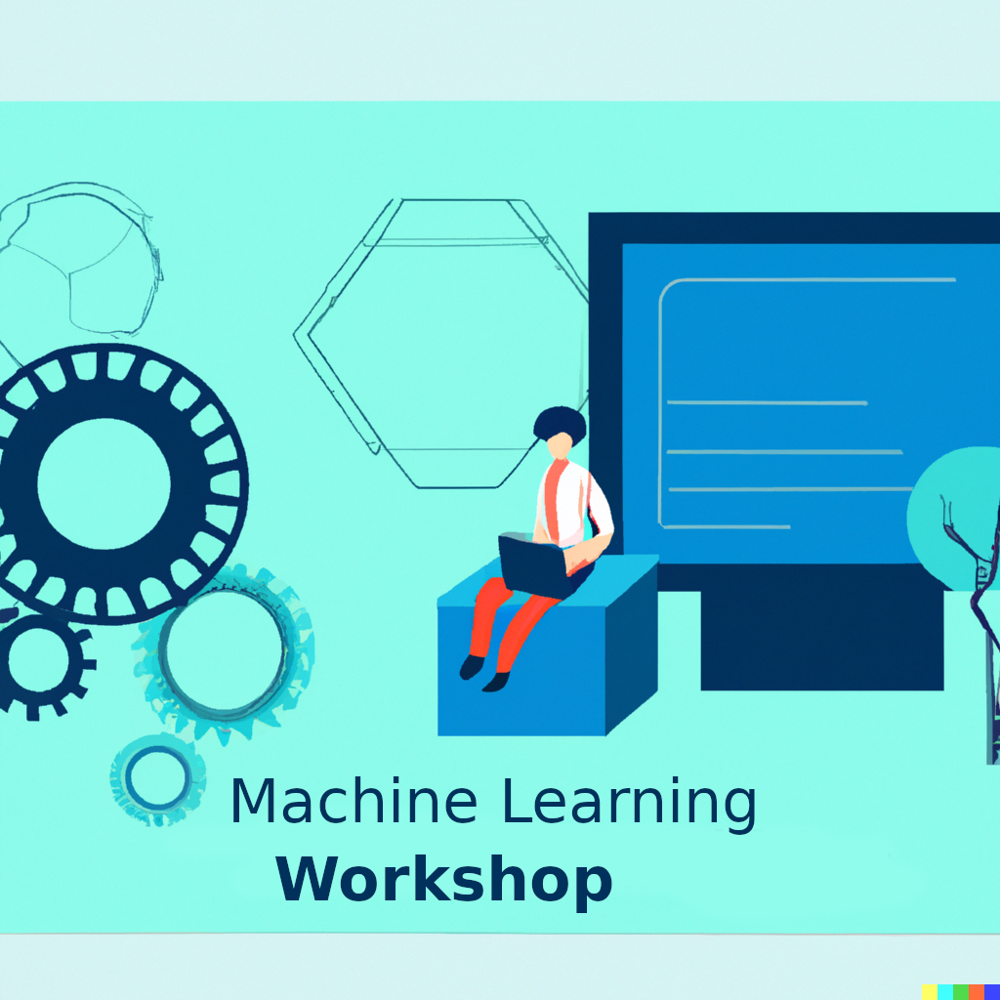

# ml-workshop-2023

 

Machine Learning with Python - A workshop with Dr. Andrea Telatin (Quadram Institute) and Dr. Giovanni Birolo (University of Turin)

## Introduction

Machine learning is a way for computers to learn from data without being explicitly programmed. This means that instead of telling a computer exactly what to do, we provide it with a set of examples and let it figure out patterns and relationships on its own.

There are two main categories of machine learning:

*  **Supervised learning**: In supervised learning, the computer is given a set of labeled examples and is asked to predict the label of new, unseen examples. For example, if we had a set of pictures of cats and dogs, with each picture labeled as either "cat" or "dog", we could train a computer to recognize whether a new picture is a cat or a dog based on its features.

* **Unsupervised learning**: In unsupervised learning, the computer is given a set of data without any labels and is asked to find patterns and structure on its own. For example, if we had a set of customer purchase histories, we could use unsupervised learning to group customers based on their purchasing behavior, without knowing anything about their demographics or preferences beforehand.

Both of these types of machine learning can be used for a variety of tasks, such as image recognition, speech recognition, and predictive modeling.

### Supervised Machine Learning

Supervised learning is a powerful technique in machine learning, and Python has many libraries and tools that make it easy to implement. One popular library for supervised learning is scikit-learn, which provides a wide range of algorithms for classification and regression tasks. Let's take the example of classifying images of handwritten digits using scikit-learn's support vector machine (SVM) algorithm. First, we would load the dataset of images and labels:

```python
from sklearn.datasets import load_digits
digits = load_digits()
```

Then, we would split the data into training and testing sets:

```python
from sklearn.model_selection import train_test_split
X_train, X_test, y_train, y_test = train_test_split(digits.data, digits.target, test_size=0.25, random_state=42)
```

Next, we would create an instance of the SVM classifier and fit it to the training data:

```python
from sklearn.svm import SVC
clf = SVC(kernel='linear', C=1)
clf.fit(X_train, y_train)
```

Finally, we would use the trained classifier to make predictions on the testing data and evaluate its accuracy:

```python
from sklearn.metrics import accuracy_score
y_pred = clf.predict(X_test)
accuracy = accuracy_score(y_test, y_pred)
print("Accuracy: ", accuracy)
```

This is just a simple example, but it shows how easy it is to implement supervised learning in Python using scikit-learn. With a little bit of data preprocessing and feature engineering, we can use these tools to tackle a wide range of real-world problems.


### Unsupervised Machine Learning

Unsupervised learning is another important technique in machine learning that involves discovering patterns and structure in data without the use of pre-labeled output data. Python also has several powerful libraries and tools that make it easy to implement unsupervised learning algorithms. One popular library for unsupervised learning is scikit-learn, which provides a range of algorithms for clustering and dimensionality reduction tasks. Let's consider an example of clustering using K-Means algorithm. First, we would load the dataset:


```python
from sklearn.datasets import load_iris
iris = load_iris()
X = iris.data
```

Then, we would create an instance of the K-Means clustering algorithm and fit it to the data:


```python
from sklearn.cluster import KMeans
kmeans = KMeans(n_clusters=3, random_state=42)
kmeans.fit(X)
```

Next, we would use the trained model to predict the cluster labels of each data point:


```python
labels = kmeans.predict(X)
```

We can also visualize the results of the clustering using a scatter plot:


```python
import matplotlib.pyplot as plt
plt.scatter(X[:, 0], X[:, 1], c=labels)
plt.xlabel('Sepal length')
plt.ylabel('Sepal width')
plt.show()
```

This example shows how easy it is to implement unsupervised learning in Python using scikit-learn. With the help of these tools, we can discover hidden patterns and structure in data and gain insights into complex systems without relying on pre-labeled data.
